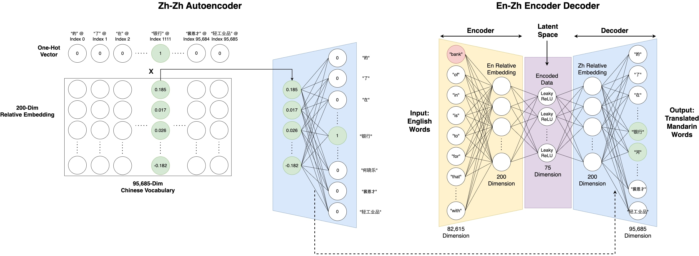

# Aligning Embedding Spaces Across Languages to Identify Word Level Equivalents in the Context of Concreteness and Emotion
[OpenReview](https://openreview.net/forum?id=pFJXNDwxrQ) | [BibTeX](#bibtex)
<p align="center">
    
</p>

[Josephine Kaminaga](https://www.linkedin.com/in/jkaminaga/) *, [Jingyi Wu](https://www.linkedin.com/in/jennie05/) *, [Daniel Yeung](https://www.linkedin.com/in/daniel-yeung-8060311a5/) *, [Simon Todd](https://sjtodd.github.io/)\
*euqal contribution, authors listed in alphabetical order

# Setup
1. Clone the repo
```
git clone https://github.com/Jenniebn/wordLevelTrans.git
cd wordLevelTrans
```
2. Environment
```
conda create -n wordLevelTrans python=3.10 -y
conda activate wordLevelTrans
```
3. Install dependencies
```
pip install -r requirements.txt
```
4. Download models and data
```
pip install --upgrade gdown && bash ./download.sh
```
This downloads all the preprocessed data and model checkpoint that produces the paper results. Note that some of the files in `data/` are preprocessed from pretrained Tencent AI Lab embeddings, which are no longer available publicly. However, we provide them as downloadable here. We also provide the one after cutting out the infrequent words, which reduces the file size from approximately 1.7GB to 80MB.
```
mkdir -p tencent_embedding
cd tencent_embedding
# ORIGINAL
gdown https://drive.google.com/file/d/1qyuY0Lq6pu-2wXJyvimP1_YN8o3nW15E/view?usp=drive_link
gdown https://drive.google.com/file/d/108uK_BSVKLPM-Mz5spCa4kWQKWUqXNvg/view?usp=drive_link
# CUT
gdown https://drive.google.com/file/d/1lXwEEcxvoCmg9-v8Tr3ReV10CM7YIU08/view?usp=drive_link
gdown https://drive.google.com/file/d/1NSHW9H0msSiBGRU98d7Q0DyfI1KJgJEG/view?usp=drive_link
cd ..
```

5. Run code on the provided test set
```
python code/test.py --conf_path confs/test.yaml
```
Find the output in ./output/timestamped. To translate any English word in the golden set, run following:
```
python code/test.py --conf_path confs/test.yaml --en_word cantaloupe
```
Note the command will throw an error if the provided English word is not inside the `data/golden_set.json`. Use `SHIFT` + `OPTION` + `F` to fomat the JSON file for Mac or `ALT` + `SHIFT` + `F` for Windows to see the list of translatable English words.

6. To see descriptions for the available flags, run
```
python code/train.py --conf_path confs/train.yaml --help_config
```

# GitHub Contents

- `dictionary/`: A directory containing all the scripts needed to scrape and process the 4 online dictionaries (Cambridge, MDBG, Yabla, and Facebook AI) we used.

    - `dictionary/golden_set`: A directory containing notebooks used to combine the four individual translation dictionaries into the full, final dictionary we used for model training, and the translation dictionary itself.
    - `dictionary/**/* Scrapers`: Directories containing notebooks used to scrape online dictionaries.
    - `dictionary/**/JSON Data`: A directory containing the unique English-Mandarin translations scraped from that dictionary. 

- `code/`: A directory containing the Python code to train and test the English to Chinese Encoder Decoder model.
- `notebooks/`: A directory containing the original development Google Colab notebooks, which you could use to run the same thing as the code in `code/`. Note though you need to set up the folder structure. 
- `static/`: A directory containing static files.

# Note
To run the scripts in `dictionary/`, please expect taking around 8 hours to fully execute as they each request around 100k webpages from various online dictionaries.

# BibTeX
```bibtex
@inproceedings{kaminaga2025aligning,
    title={Aligning Embedding Spaces Across Languages to Identify Word Level Equivalents in the Context of Concreteness and Emotion},
    author={Josephine Kaminaga and Jennie Wu and Daniel Yeung and Simon Todd},
    booktitle={2025 Meeting of the Society for Computation in Linguistics},
    year={2025},
    url={https://openreview.net/forum?id=pFJXNDwxrQ}
}
```

# Acknowledgement
We'd like to thank Professor Todd for his insightful instructions.\
This repository is based on [relreps](https://github.com/lucmos/relreps?tab=readme-ov-file) from Moschella et al. and [Tecent AI Lab](https://ai.tencent.com/ailab/nlp/en/embedding.html).\
This work is supported by [UCSB URCA grant](https://urca.ucsb.edu/urca-grant/overview). 
